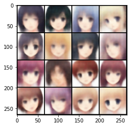
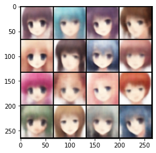
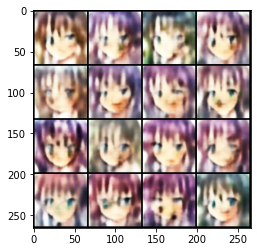
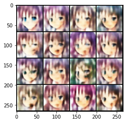
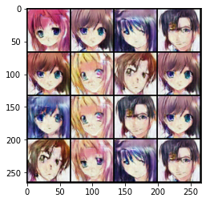
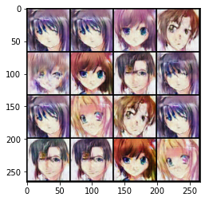

# Anime Image Generation through deep learning
We will implement image generation through VAE, hierarchical VAE and GAN

### Table of Contents

1. [Installation](#installation)
2. [Project Motivation](#motivation)
3. [File Descriptions](#files)
4. [Results](#results)
5. [Licensing, Authors, and Acknowledgements](#licensing)

## Installation 
The project uses the following libraries in addition to Anaconda with python version:3.7.4.
- pandas
- numpy
- Pytorch 1.7.0
- Pytorch Lightning 1.2.0
- matplotlib

## Project Motivation 
In this project, we will dive into the Anime dataset which is available on Kaggle([Anime dataset](https://www.kaggle.com/splcher/animefacedataset)). In order to understand the how image generation models (VAE, HVAE and GANs) work.

## File Descriptions 
This folder contains jupyter notebooks.
1. **image_generation.ipnyb**: This notebook contains the pytorch and pytorch Lightning implementation of VAE, HVAE and DCGAN.

## Results 
The main findings of the code:
### VAE Results
 

### HVAE Results
 

### GAN Results
 

## Licensing, Authors, Acknowledgements 
Must give credit to Kaggle for the data. You can find the Licensing for the data and other descriptive information at the Kaggle link available [here](https://www.kaggle.com/splcher/animefacedataset).
